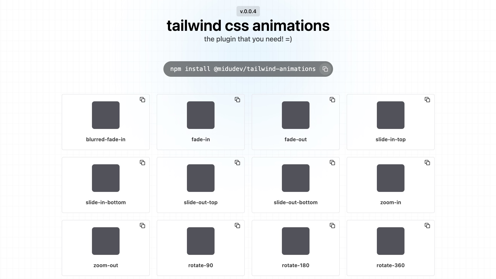

<div align="center">

# Awesome Tailwind Animations

[](./README.md)
[](./README.es.md)





Obten animaciones de CSS con una sola clase de Tailwind!

Visita la [web](https://tailwindcss-animations.vercel.app/) para obtener más
información.

</div>

## Instalación

Instala el paquete con tu gestor de paquetes favorito:

```sh
$ npm install @midudev/tailwind-animations
$ pnpm add @midudev/tailwind-animations
$ yarn add @midudev/tailwind-animations
```

Usa el plugin en tu configuración de Tailwind:

```js

// tailwind.config.mjs
import animations from '@midudev/tailwind-animations'

export default {
  // resto de opciones
  plugins: [
    animations
  ],
}

```

## Uso

Este plugin trae varias clases de utilidad así como varias animaciones CSS listas para usar. Aquí tienes algunos ejemplos simples:

```html
<div class="animate-fade-in">
  Fade in box
</div>

<div class="animate-slide-in-bottom animate-delay-300 animate-duration-slow">
  Slow animation after 300ms to slide in from bottom
</div>
```

### Animates Timeline

Este plugin también trae una clase de utilidad para animar elementos basados en su posición en la ventana. Puedes usar la clase `view-animate-single` o `view-animate-[animation]` para poder generar cualquier nombre a tu timeline.

```html
<div class="w-3/4 max-w-[800px] m-[0_auto]">
<h1>Content</h1>

<p>
  Lorem ipsum dolor sit amet, consectetur adipiscing elit, sed do eiusmod
  tempor incididunt ut labore et dolore magna aliqua. Risus quis varius quam
  quisque id. Et ligula ullamcorper malesuada proin libero nunc consequat
  interdum varius. Elit ullamcorper dignissim cras tincidunt lobortis feugiat
  vivamus at augue.
</p>

<p>
  Dolor sed viverra ipsum nunc aliquet. Sed sed risus pretium quam vulputate
  dignissim. Tortor aliquam nulla facilisi cras. A erat nam at lectus urna
  duis convallis convallis. Nibh ipsum consequat nisl vel pretium lectus.
  Sagittis aliquam malesuada bibendum arcu vitae elementum. Malesuada bibendum
  arcu vitae elementum curabitur vitae nunc sed velit.
</p>

<div
  class="w-72 h-52 m-[0_auto] bg-[deeppink] view-animate-[--subjectReveal] animate-zoom-in animate-range-[entry_10%_contain_25%]">
</div>

<p>
  Adipiscing enim eu turpis egestas pretium aenean pharetra magna ac. Arcu
  cursus vitae congue mauris rhoncus aenean vel. Sit amet cursus sit amet
  dictum. Augue neque gravida in fermentum et. Gravida rutrum quisque non
  tellus orci ac auctor augue mauris. Risus quis varius quam quisque id diam
  vel quam elementum. Nibh praesent tristique magna sit amet purus gravida
  quis. Duis ultricies lacus sed turpis tincidunt id aliquet. In egestas erat
  imperdiet sed euismod nisi. Eget egestas purus viverra accumsan in nisl nisi
  scelerisque. Netus et malesuada fames ac.
</p>
</div>
```
> Ejemplo extraido de [MDN](https://developer.mozilla.org/en-US/docs/Web/CSS/view-timeline)

## Contribuidores

<a href="https://github.com/midudev/tailwind-animations/graphs/contributors">
  
</a>
